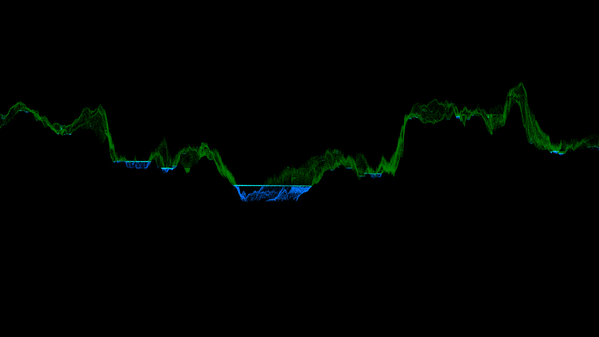

# Mapping-Mountainous-Arctic-Lakes-From-the-Air
Mapping Mountainous Arctic Lake Watersheds From the Air

# Run the script by giving it paths to the data
python Y:/William/GitHub/Mapping-Mountainous-Arctic-Lakes-From-the-Air/Hydrological_processing.py D:/Abisko/Abisko_watersheds/National_2m_dem/ D:/temp/test_raided_speed/ --streaminitation=2500 --outlets=D:/Abisko/Abisko_watersheds/lake_outlets/outlets.shp --watershed_dir=D:/Abisko/Abisko_watersheds/watersheds/
